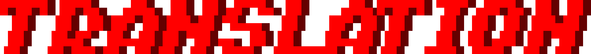
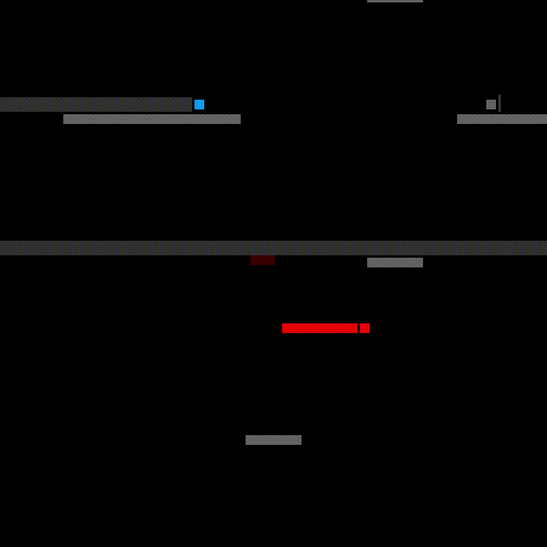

# 

## About
*TRANSLATION* is pure platforming.

In each level, the player takes on sentries: enemies who patrol a platform.
These sentries have a variety of abilities that can affect the player, the stage, gravity, or even other sentries.
The level is completed once the player has crushed all of the sentries in the level.
The player cannot die, but being pushed off the stage will reset the level.

The player is equipped with a two types of teleportation that combine to create a completely unique movement system unlike anything you've played before.

## Features
- 12-level tutorial to familiarize players with the game's systems
- Four 16-level campaigns
- Level editor

## Download
You can download the game on [Itch.io](https://flinkerflitzer.itch.io/translation).
You will need at least the Java 17 runtime installed to run the game directly.

